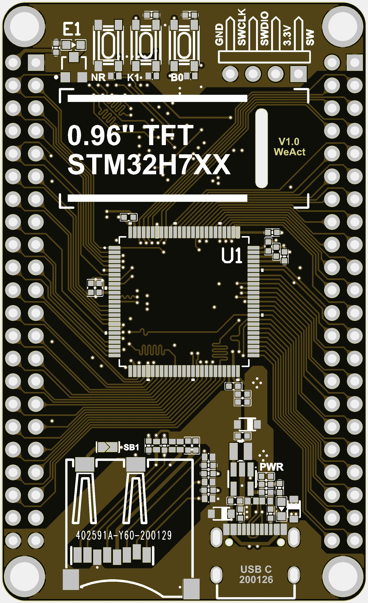
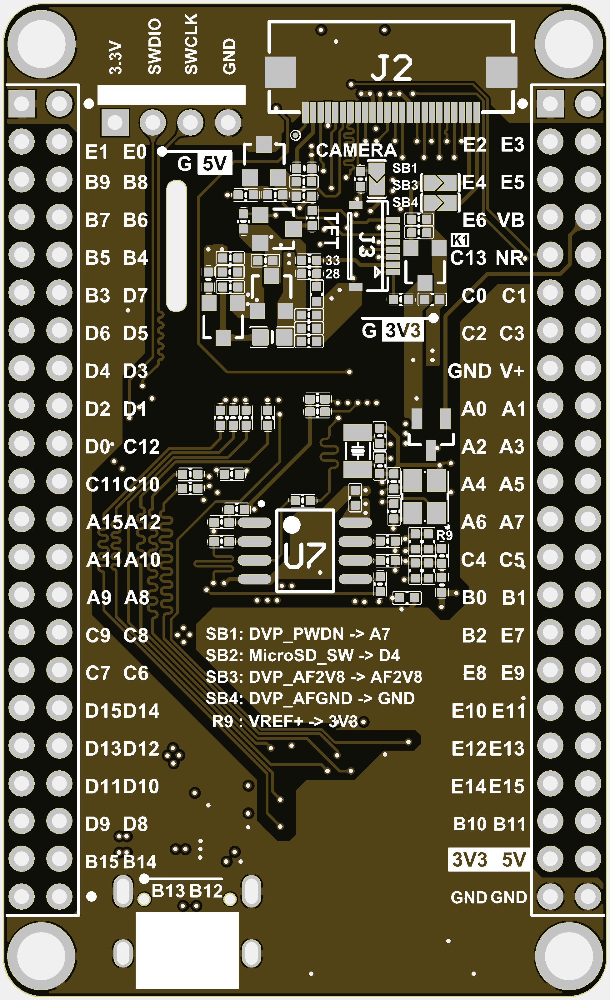

# STM32H7xx Core Board
> `0.96''` TFT, TF Card, 16MB QSPI FLASH, DVP Port

# STM32H750VBT6
> Freq 480Mhz,1MB RAM,128KB ROM,16MB Extern ROM(QSPI FLASH)
# STM32H743VIT6
> Freq 480Mhz,1MB RAM,2MB ROM,16MB Extern ROM(QSPI FLASH)
## Coming Soon ...
|||
| :--: | :--: |

