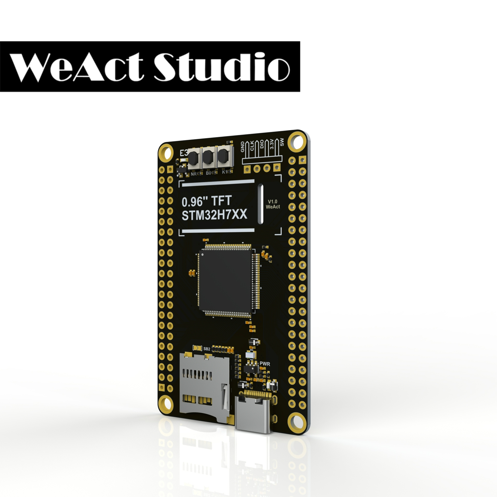
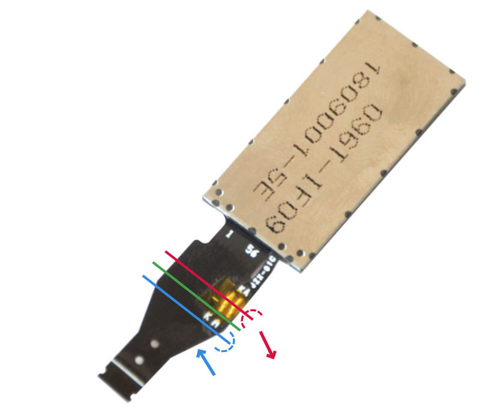
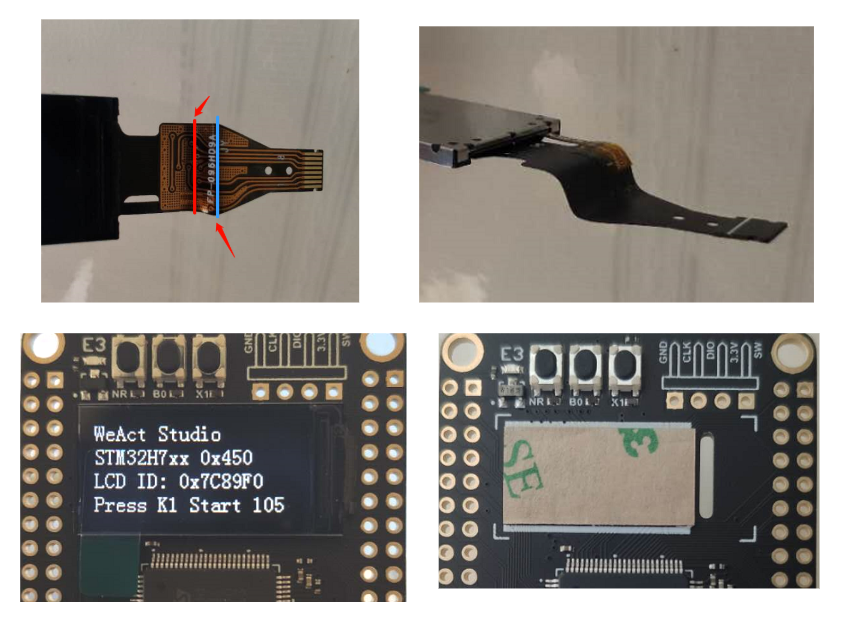
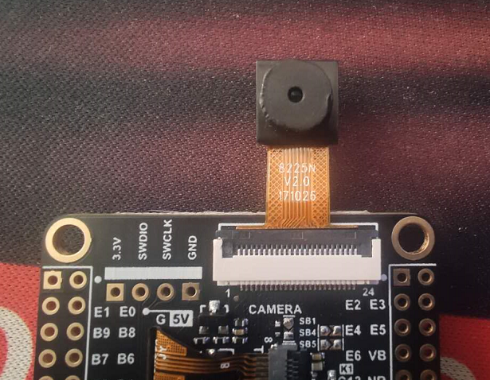
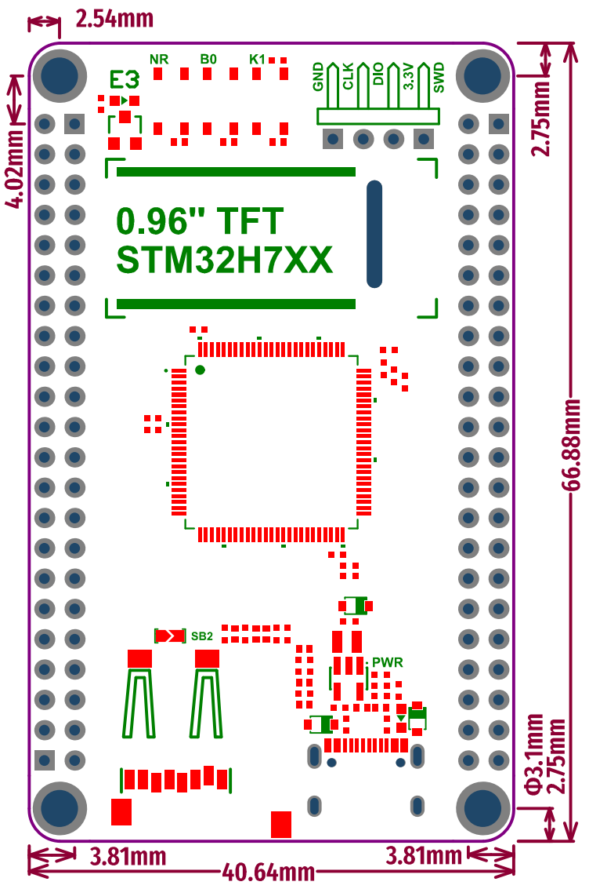

# STM32H7xx Core Board 
> `0.96''` ST7735 TFT, TF Card, 8MB SPI FLASH(SPI1)， 8MB QSPI FLASH(QSPI1), 8Bit DVP Port

> support openmv firmware, see SDK/openmv

## STM32H750VBT6 128KB ROM, 1MB RAM
* ARM Cortex M7
* 480Mhz Max. Freq
* 128KB ROM, 1MB RAM
* 8MB SPI Flash, 8MB QSPI Flash

## STM32H743VIT6 2048KB ROM, 1MB RAM
* ARM Cortex M7
* 480Mhz Max. Freq
* 2048KB ROM, 1MB RAM
* 8MB SPI Flash, 8MB QSPI Flash

### 接口和按键 Interface and Keys
* 2*22 Pin 2.54mm I/O x 2
* 4 Pin 2.54mm SW x 1
* USB C (type C)  x 1
* MicroSD TF x 1
* 8Bit DCMI x 1
* User Key K1 (PC13) x 1
* NRST Key x 1
* BOOT0 Key x 1

### 设计和质量 Design and Quality
#### 中文
* 采用沉金TG155板材，四层板设计
* 采用无铅焊接工艺
* 采用按键的形式设置BOOT
* 采用高质量晶振，金属外壳，均能良好起振
* 始终使用原装ST芯片
> 不提供出厂测试程序，防止翻版出现，影响质量
#### English
* `TG155` plate with gold sinking process is designed with four layers
* Use `Lead-Free` welding process
* Use the button to set BOOT
* Use high quality crystal vibration, metal shell, all can be good vibration
* Always use the original ST chip
> We do not provide the factory test firmware to prevent the appearance of duplicates, affecting the quality

### 芯片批号 Chip Date Code
| STM32H750VBT6 | STM32H743VIT6 |
| :--: | :--: |
|Date Code|Date Code|
|930 (2020.06)||
|031 (2020.10)|036 (2020.10)|

### 淘宝购买链接
1. [WeAct Studio官方店](https://shop118454188.taobao.com/index.htm?spm=2013.1.w5002-17867322799.2.212f5cb16nqwNP)

### AliExpress
1. [WeAct Studio Official Store](https://weactstudio.aliexpress.com/)

## 开始使用 Begin to use
### 安装 Install 0.96'' ST7735 TFT 

#### 中文说明 
1. 沿红色划线处向下弯折90°，可使用核心板板边辅助弯折
2. 沿蓝色划线处向上弯折90°，可使用核心板板边辅助弯折
3. 绿色划线处请勿弯折，避免造成屏幕排线断路
4. 核心板屏幕安装处粘贴双面胶，之后按照屏幕排线折叠纹路可轻松完成屏幕安装
> 注：粘贴安装时，请确保屏幕边框未接触板上的电子元件
#### English
1. Bend down 90° along the red line, and use the edge of the core plate to assist bending
2. Bend up 90° along the blue line, and use the edge of the core plate to assist bending
3. Do not bend the green line to avoid breaking the screen line
4. Double-sided adhesive tape is pasted at the installation place of the core board screen, and then screen installation can be easily completed according to the line folding pattern of the screen
> Note: When pasting the installation, make sure that the screen border does not touch the electronic components on the board

### 安装摄像头 Install Camera
* Support Sensor: OV7670, OV2640, OV7725, OV5640-AF
* 如果使用OV5640自动对焦功能，务必焊接SB4，SB5
* If USING OV5640 auto focus function, be sure to weld SB4, SB5

### 出厂例程说明 Factory test firmware introduction
1. 屏幕测试    Screen test
2. 摄像头测试  Camera test
3. ADC 测试   ADC test
4. Flash 和 TF卡测试 Flash and TF card test
> 点击按键`K1`切换到下一个测试项目 Click `K1` to switch to the next test item

### 如何进入ISP模式 How to enter ISP mode
#### 中文说明 
* 方法1：上电状态下，按住BOOT0键和复位键，然后松开复位键，0.5秒后松开BOOT0键
* 方法2：掉电状态下，按住BOOT0键，上电后0.5S松开BOOT0
* DFU模式：使用数据线连接电脑即可
* 串口模式：使用USB转串口连接核心板的PA9,PA10即可
* 软件： STM32CubeProg。
#### English
* Method 1: When the power is on, press the BOOT0 key and the reset key, then release the reset key, and release the BOOT0 key after 0.5 seconds
* Method 2: When the power is off, hold down the BOOT0 key, and release the BOOT0 at 0.5s after the power is on
* DFU Mode: Use the data line to connect to the computer.
* Serial Port Mode: Connect PA9 and PA10 of core board with USB serial port
* Soft: STM32CubeProg。

### 电源及尺寸 Power supply and Board Shape
* Input Voltage: 3.3V-5.5V
* DC-DC Output Current: 1A Max.
* Size: 40.64mm * 66.88mm

