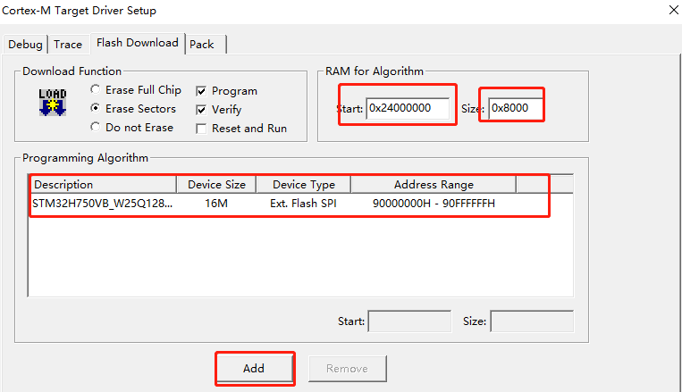
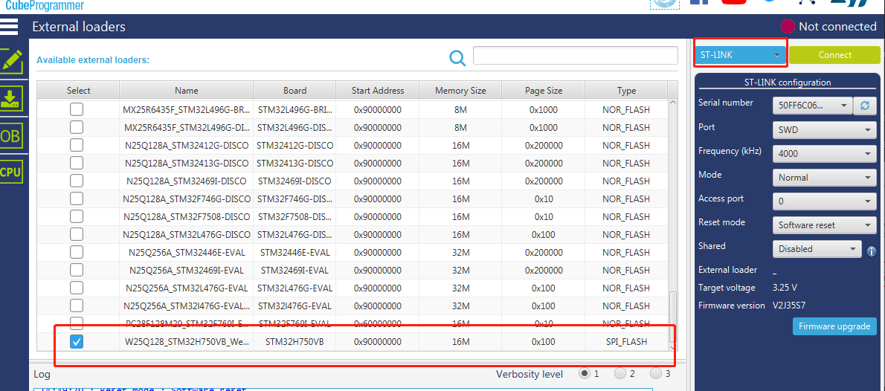
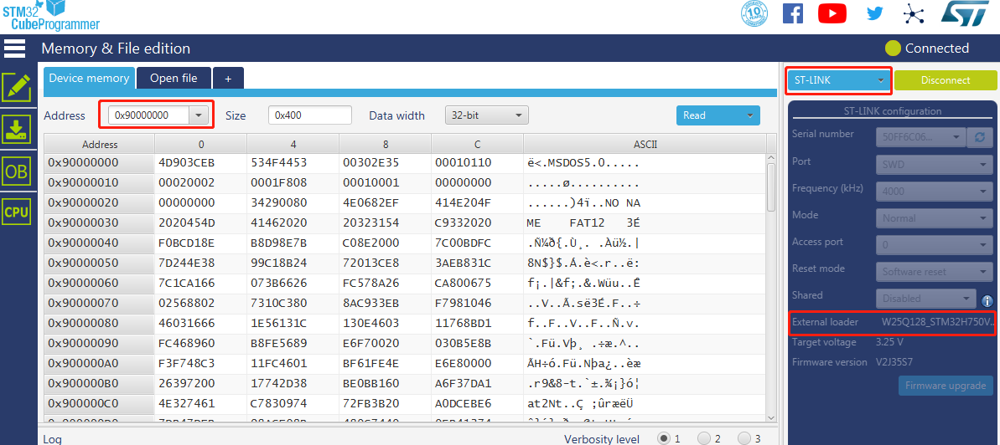

# QSPI Flasher

## STM32H750VB_W25Qxx_WeActStudio.FLM
> Keil MDK
Support 4MB ~ 16MB W25Qxx Flash

请将文件复制到 `Keil安装目录\ARM\Flash\`

Please copy the file to `"KeilInstallationDirectory"\ARM\Flash`

## STM32H750VB_W25Qxx_WeActStudio.stldr
> STM32CubeProgrammer
Support 4MB ~ 16MB W25Qxx Flash

请将文件复制到 `STM32CubeProgrammer安装目录\bin\ExternalLoader\`

Please copy the file to `"STM32CubeProgrammerInstallationDirectory"\bin\ExternalLoader\`

