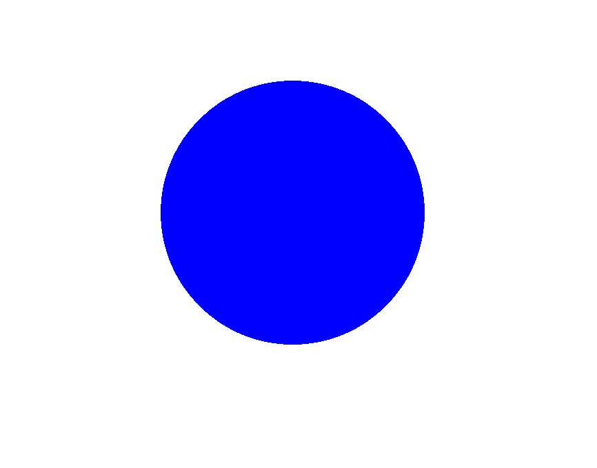

# 使用说明

* [English](README_EN.md)

当前例程为圆形颜色识别(红、绿、蓝)的例程，可以使用下面的图片进行测试




识别成功则为如下结果

`recognize color is red!`

或者

`recognize color is green!`

或者

`recognize color is blue!`

识别失败则是

`Not recognized!`

如果使用的是0v7725 请将下面两行代码反注释

``` c
sensor.set_hmirror(True)
sensor.set_vflip(True)
```

不同环境对应阈值也不同请根据你所在环境的阈值进行调整，也就是下面红绿蓝三个阈值

``` c
red_threshold = (53, 31, 44, 82, 18, 78)
green_threshold = (54, 90, -64, -30, -19, 108)
blue_threshold = (34, 65, 22, 60, -100, -29)
```

对应IDE相应操作为：工具->机器视觉->阈值编辑器->帧缓冲区
