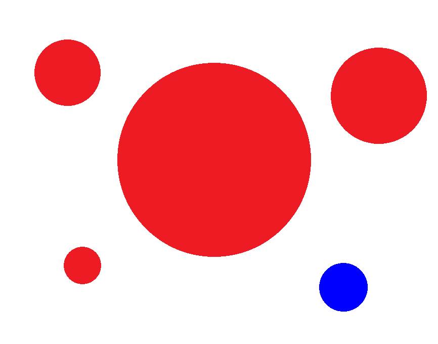

# Instructions
The current routine is a routine that tracks a circle, and you can test it using the following picture



If you are using 0v7725, uncomment the following two lines of code

``` c
sensor.set_hmirror(True)
sensor.set_vflip(True)
```

Different environments have different thresholds. Please adjust them according to the thresholds of your environment, namely the following three thresholds: red, green and blue

``` c
red_threshold = (53, 31, 44, 82, 18, 78)
```

The corresponding operation of the IDE is: tool -> machine vision -> threshold editor -> frame buffer
